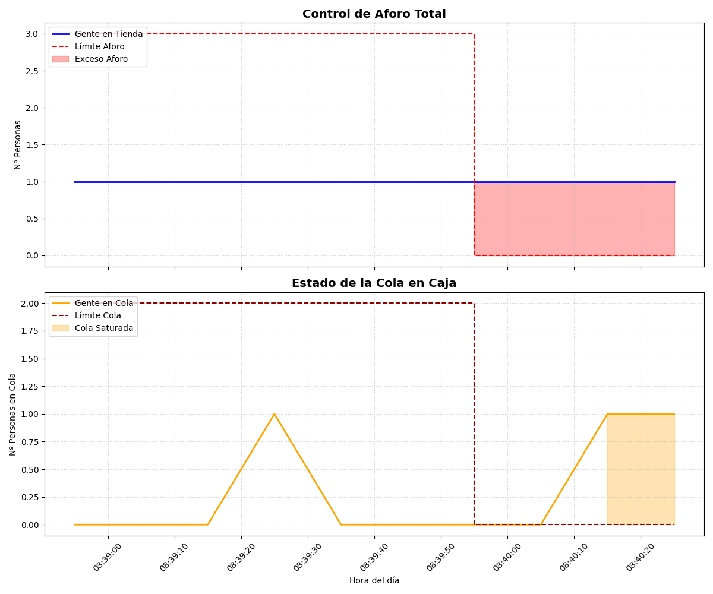

# 🛡️ Sistema de Control de Aforo con IA

Este proyecto implementa un sistema de visión artificial en tiempo real para el conteo de personas y la gestión de aforos. El sistema utiliza IA para detectar presencia humana y emite alertas por voz de forma inteligente cuando se supera el límite de seguridad.

## 🌟 Características principales
- **Detección en tiempo real:** Utiliza el modelo **YOLOv8** de Ultralytics.
- **Aceleración por GPU:** Optimizado para la tarjeta gráfica **NVIDIA GeForce RTX 4050** mediante núcleos CUDA.
- **Control Dinámico:** Incluye barras deslizantes (*Trackbars*) para ajustar tanto el límite de aforo como el de la cola sin detener el programa.
- **Alertas de Voz Inteligentes:** Emite un aviso por voz inmediato al detectar el aforo excedido; si tras un tiempo la situación persiste, el sistema lanza recordatorios periódicos para asegurar el cumplimiento de la norma.
- **Multihilo (Threading):** Implementado para separar la lógica de visión artificial de la de audio. Esto garantiza que la tasa de FPS se mantenga constante aunque el sistema esté emitiendo alertas sonoras.
* **Privacidad Proactiva:** Difuminado elíptico de rostros para anonimización.
- **Gestión de Colas en Caja:** El sistema detecta cuánta gente hay esperando para pagar y avisa visualmente si la cola es demasiado larga.
- **Analítica de Negocio:** Genera gráficas automáticas y registros en Excel (CSV) con el historial de ocupación y colas.

## 🚀 ¿Por qué esto ayuda a vender más?
* **Evita colas desesperantes:** La gran mayoría de los clientes se va si ve una cola muy larga. Este sistema te avisa antes de que pierdas la venta.
* **Optimiza tus turnos:** Con los datos del Excel convertidos en gráficas, puedes ver qué horas son las más críticas y poner a tus empleados solo cuando realmente hace falta, ahorrando dinero.
* **Privacidad y Confianza:** Al emborronar las caras, cumples con la ley (GDPR) y tus clientes se sienten más cómodos comprando.

### 📊 Analítica Inteligente: Tu negocio en un vistazo
Al cerrar el programa, el sistema genera automáticamente un **Panel de Control Visual** con dos gráficas de alta precisión. Ya no tienes que adivinar qué ha pasado; ahora tienes los datos para tomar el mando:



* **Monitor 1: Control de Aforo Total:** Visualiza el flujo de personas en tienda. La zona sombreada en rojo marca los momentos de saturación donde la seguridad o la comodidad de tus clientes estuvo en riesgo.
* **Monitor 2: Gestión de Cola en Caja:** Un gráfico dedicado a medir el "estrés" de tus cajas. Las zonas naranjas indican cuándo tus clientes empezaron a esperar más de la cuenta.
* **Detección de "Ventas Perdidas":** Al cruzar ambas gráficas, puedes identificar cuándo la cola creció rápido y la gente empezó a marcharse. Es el sensor perfecto para frenar la fuga de clientes por desesperación.
* **Ahorro en Costes de Personal:** Deja de pagar horas extra por intuición. Identifica tus **"Horas Críticas"** reales para reforzar el equipo solo cuando la gráfica muestra saturación recurrente, optimizando tu presupuesto.
* **Análisis de Eficiencia y Conversión:** Comparar ambos monitores te da la clave real de tu negocio:
    * *Tienda media pero cola saturada:* Tienes un **cuello de botella** técnico o de personal que frena tus ingresos.
    * *Tienda llena pero cola vacía:* O tus cajeros son extremadamente rápidos, o tienes un problema de **conversión** (la gente entra pero no encuentra qué comprar).
## 🛠️ Requisitos e Instalación

### 1. Sistema Operativo y Audio
Este sistema está diseñado para **Ubuntu / Linux**. Para la reproducción de alertas de voz, es necesario instalar el motor de audio externo:
```bash
sudo apt update && sudo apt install mpg123 -y
```
